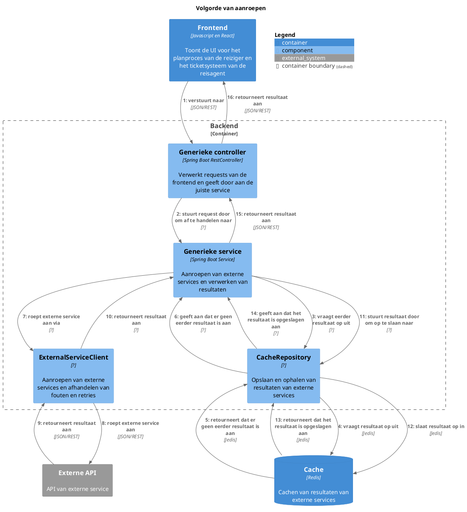

# Voorbereiding
De ontwerpvraag is alleen van belang voor de backend, omdat de frontend geen directe interactie heeft met externe services. De belangrijke componenten in de backend zijn:
- Generieke controller
- Generieke service
- CacheRepository
- Cache
- ExternalServiceClient

# Pressure cooker

## Componenten en verantwoordelijkheden
- **Generieke controller**: Verantwoordelijk voor het verwerken van requests van de frontend en het doorgeven aan de juiste service.
- **Generieke service**: Verantwoordelijk voor het aanroepen van externe services en het verwerken van de resultaten.
- **CacheRepository**: Verantwoordelijk voor het opslaan en ophalen van resultaten van externe services om prestaties te verbeteren en afhankelijkheid van externe services te verminderen.
- **ExternalServiceClient**: Verantwoordelijk voor het aanroepen van externe services en het afhandelen van fouten en retries.
- Buiten container: **Cache**: Verantwoordelijk voor het cachen van resultaten van externe services.

## Interfaces
- **Generieke controller**:
    ```
    GET /flights
    Body: {
        origin: string,
        destination: string,
        departureDate: Date,
        returnDate: Date
    }
    ```
- **Generieke service**:
    ```java
    public interface FlightsService {
        public List<Flight> getFlights(String origin, String destination, Date departureDate, Date returnDate);
    }
    ```
- **CacheRepository**:
    ```java
    public interface CacheRepository {
        public void save(Endpoint key, String response, Duration duration);
        public String get(Endpoint key);
    }

    public record Endpoint(Method method, String url, String queryParams, String bodyHash) {
        public Endpoint(Method method, String url, String queryParams) {
            this(method, url, queryParams, "");
        }

        public Endpoint(Method method, String url, String body) {
            this(method, url, "", body);
        }

        public Endpoint(Method method, String url) {
            this(method, url, "", "");
        }
    }

    public enum Method {
        GET, POST, PUT, DELETE
    }
    ```
- **ExternalServiceClient**:
    ```java
    public interface ExternalServiceClient {
        public Optional<String> call(Endpoint endpoint);
    }
    ```

## Volgorde van aanroepen


## Classes en functies

> [!WARNING]
>
> TODO: Dit onderdeel is volledig gegenereerd door AI. Zal dit later nog aanpassen.

```puml
title C4 Class Diagram - Backend

interface FlightsService {
    List<Flight> getFlights(String origin, String destination, Date departureDate, Date returnDate)
}

interface CacheRepository {
    void save(Endpoint key, String response, Duration duration)
    String get(Endpoint key)
}

class Endpoint {
    +Method method
    +String url
    +String queryParams
    +String bodyHash
    Endpoint(Method method, String url, String queryParams, String bodyHash)
    Endpoint(Method method, String url, String queryParams)
    Endpoint(Method method, String url, String body)
    Endpoint(Method method, String url)
}

enum Method {
    GET
    POST
    PUT
    DELETE
}

interface ExternalServiceClient {
    Optional<String> call(Endpoint endpoint)
}

class Cache {
    +save(String key, String value, Duration duration)
    +String get(String key)
}

FlightsService --> ExternalServiceClient : uses
FlightsService --> CacheRepository : uses
CacheRepository --> Cache : uses
CacheRepository --> Endpoint : uses
ExternalServiceClient --> Endpoint : uses

@enduml
```