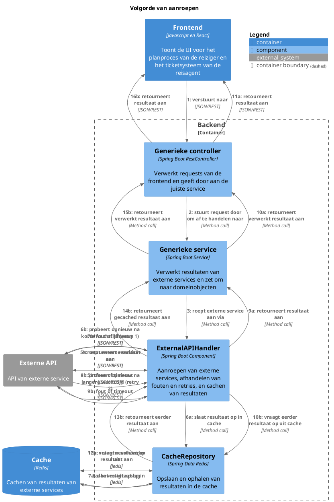
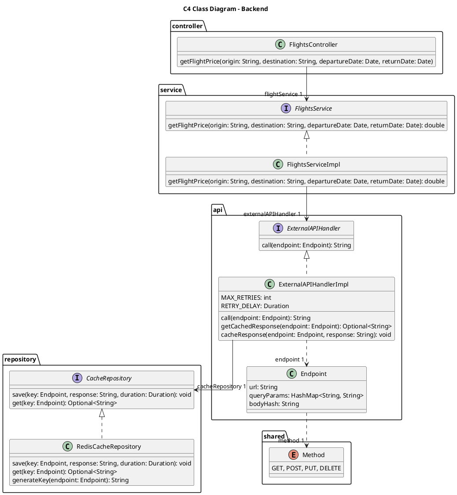

# Ontwerpvraag
**Fault Tolerance**
- Hoe ga je om met aanroepen van externe services die niet beschikbaar zijn en toch verwacht wordt dat er waardevolle output gegeven wordt?

# Voorbereiding
De ontwerpvraag is alleen van belang voor de backend, omdat de frontend geen directe interactie heeft met externe services. De belangrijke componenten in de backend zijn:
- Generieke controller
- Generieke service
- CacheRepository
- Cache
- ExternalServiceClient

# Pressure cooker

## 1. Componenten en verantwoordelijkheden
- **Generieke controller**: Verantwoordelijk voor het verwerken van requests van de frontend en het doorgeven aan de juiste service.
- **Generieke service**: Verantwoordelijk voor het verwerken van de resultaten van externe services en het omzetten naar domeinobjecten.
- **ExternalAPIHandler**: Verantwoordelijk voor het aanroepen van externe services, het afhandelen van fouten en retries, en het cachen van resultaten om fault tolerance te bieden.
- **CacheRepository**: Verantwoordelijk voor het opslaan en ophalen van resultaten in de cache. Wordt gebruikt door de ExternalAPIHandler.
- Buiten container: **Cache**: Verantwoordelijk voor het cachen van resultaten van externe services.

## 2. Interfaces
- **Generieke controller**:
    ```
    GET /flights
    Body: {
        origin: string,
        destination: string,
        departureDate: Date,
        returnDate: Date
    }
    ```
- **Generieke service**:
    ```java
    public interface FlightsService {
        public List<Flight> getFlights(String origin, String destination, Date departureDate, Date returnDate);
    }
    ```
- **CacheRepository**:
    ```java
    public interface CacheRepository {
        public void save(Endpoint key, String response, Duration duration);
        public String get(Endpoint key);
    }

    public record Endpoint(Method method, String url, HashMap<String, String> queryParams, String bodyHash) {
        public Endpoint(Method method, String url, HashMap<String, String> queryParams) {
            this(method, url, queryParams, "");
        }

        public Endpoint(Method method, String url, String body) {
            this(method, url, new HashMap<>(), body);
        }

        public Endpoint(Method method, String url) {
            this(method, url, new HashMap<>(), "");
        }
    }

    public enum Method {
        GET, POST, PUT, DELETE
    }
    ```
- **ExternalAPIHandler**:
    ```java
    public interface ExternalAPIHandler {
        public String call(Endpoint endpoint);
    }
    ```

## 3. Volgorde van aanroepen


## 4. Classes en functies
