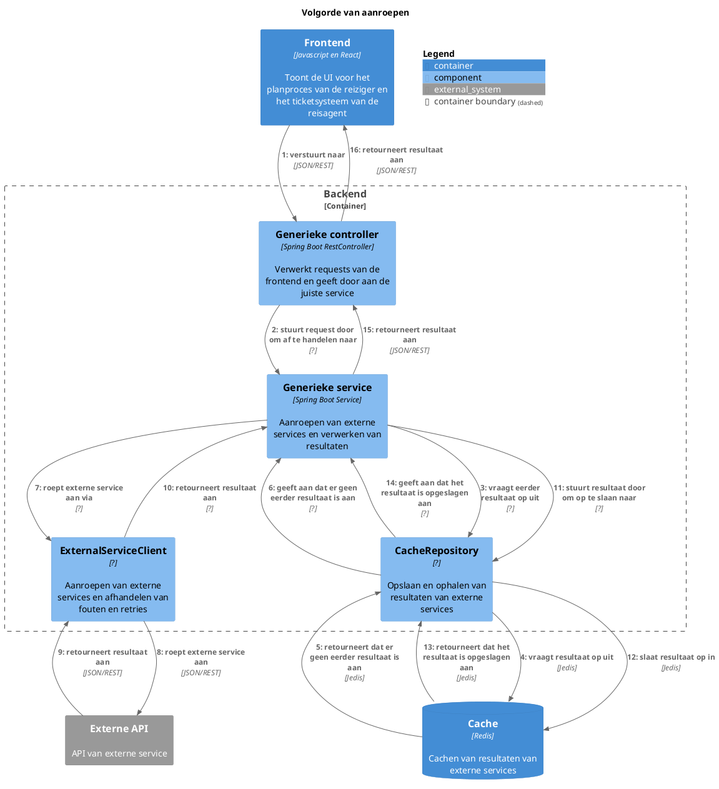

# Opdracht
Nu je 7 design principes en design properties (her)kent is het tijd deze toe te passen op je eigen ontwerp. Kies uit de casusopdracht een ontwerpvraag, maar overleg met je groepje: elke vraag mag binnen 1 groepje slechts 1 keer gekozen worden.

Werk hiervoor een (deel van een) component diagram uit dat past bij de ontwerpvraag.

*10 minuten* Voorbereiding

Kies de componenten uit die je nodig hebt om de ontwerpvraag te beantwoorden. Voer nu de volgende stappen uit in de vorm van een ultrakorte design sprint (ook wel pressure cooker genoemd) waarbij elke stap getimeboxed is. Er is geen tijd voor perfectie, het gaat om snelheid en het maken van keuzes, waarbij elke keuze vooralsnog goed is. De eerste drie stappen zijn 20 minuten, de laatste stap is 30 minuten, zet een wekker/timer om je tijd te bewaken. Deze huiswerkopdracht duurt inclusief voorbereiding dus exact 100 minuten.

*90 minuten* Pressure cooker

- *20 minuten* Het bepalen welk component waarvoor verantwoordelijk is en een naam kiezen die past bij die verantwoordelijkheid (Encapsulate What Varies, Single Responsibility Principle, Cohesion, Separation of concerns). De uitkomst van deze stap is een lijst van componenten met een naam en een verantwoordelijkheid.
- *20 minuten* Het beschrijven van de interfaces van de betrokken componenten (Program to an interface). De uitkomst van deze stap is een lijst van interfaces met een methoden en een eerste versie van parameters en returnwaarden.
- *20 minuten* Het kiezen van een volgorde van aanroepen waarin de componenten samenwerken (Coupling). De uitkomst van deze stap is een dynamic diagram met componenten.
- *30 minuten* Het opdelen van de componenten in een of meerdere classes en/of functies (Open/Closed Principle, Extensibility, Composition over inheritance, Law of Demeter, Information hiding). De uitkomst is een class diagram met classes en functies (het code/class level van C4).

## Context

### 7 Design properties
- **Information Hiding**
    Information hiding is het principe dat details van de implementatie van een module verborgen moeten worden voor de gebruikers van die module. Dit vermindert de complexiteit en maakt het gemakkelijker om modules te wijzigen zonder de gebruikers te beïnvloeden.
- **Cohesion**
    Cohesion is de mate waarin de elementen van een module gerelateerd zijn aan elkaar. Een module met hoge cohesion heeft elementen die sterk gerelateerd zijn en samen een duidelijke verantwoordelijkheid hebben.
- **Coupling**
    Coupling is de mate waarin modules afhankelijk zijn van elkaar. Modules met hoge coupling zijn sterk afhankelijk van elkaar en moeilijk te hergebruiken of te testen.
- **Separation of Concerns**
    Separation of concerns is een specifieke vorm van coupling waarbij modules verantwoordelijkheden scheiden om de complexiteit te verminderen en de herbruikbaarheid te vergroten.
- **Extensibility**
    Extensibility is de mate waarin een systeem gemakkelijk kan worden uitgebreid met nieuwe functionaliteit. Een systeem met hoge extensibility is flexibel en kan gemakkelijk worden aangepast.

### 7 Design principes
- **Encapsulate What Varies**
    Identificeer en scheid de delen van de code die vaak veranderen. Stop deze in aparte modules of klassen om flexibiliteit en onderhoudbaarheid te verbeteren.
- **Program to an Interface**
    Schrijf code die afhankelijk is van abstracties (interfaces) in plaats van concrete implementaties. Dit verhoogt herbruikbaarheid en maakt het makkelijker om implementaties te vervangen.
- **Composition over Inheritance**
    Gebruik objectcompositie (het combineren van objecten) in plaats van overerving. Dit voorkomt starre hiërarchieën en maakt systemen flexibeler en beter uitbreidbaar.
- **Law of Demeter**
    Een object mag alleen direct communiceren met zijn directe buren en niet met diep geneste objecten. Dit vermindert afhankelijkheden en maakt de code minder breekbaar.
- **Single Responsibility Principle**
    Een klasse of module mag maar één reden hebben om te veranderen. Dit betekent dat elke klasse slechts één duidelijke verantwoordelijkheid heeft.
- **Open/Closed Principle**
    Code moet open zijn voor uitbreiding, maar gesloten voor wijziging. Dit betekent dat nieuwe functionaliteit moet worden toegevoegd via extensie (bijv. via interfaces of overerving), zonder bestaande code te wijzigen.
- **Dependency Inversion Principle**
    Hoog-niveau modules mogen niet afhankelijk zijn van laag-niveau modules; beide moeten afhankelijk zijn van abstracties. Dit verhoogt de loskoppeling en testbaarheid van de code.

### Ontwerpvraag
- **Fault Tolerance**
    *Hoe ga je om met aanroepen van externe services die niet beschikbaar zijn en toch verwacht wordt dat er waardevolle output gegeven wordt?*

### Ideeen voor ontwerpvraag oplossing
- Vorige results cachen met redis
- Retry mechanisme
<!-- - Mogelijk Circuit breaker
    - Dit is een mechanisme dat voorkomt dat een applicatie blijft proberen een externe service aan te roepen die niet beschikbaar is. In plaats daarvan wordt een alternatieve route genomen of wordt een foutmelding gegeven. -->

# Uitwerking

## Voorbereiding
De ontwerpvraag is alleen van belang voor de backend, omdat de frontend geen directe interactie heeft met externe services. De belangrijke componenten in de backend zijn:
- Generieke controller
- Generieke service
- CacheRepository
- Cache
- ExternalServiceClient

## Pressure cooker

### Componenten en verantwoordelijkheden
- **Generieke controller**: Verantwoordelijk voor het verwerken van requests van de frontend en het doorgeven aan de juiste service.
- **Generieke service**: Verantwoordelijk voor het aanroepen van externe services en het verwerken van de resultaten.
- **CacheRepository**: Verantwoordelijk voor het opslaan en ophalen van resultaten van externe services om prestaties te verbeteren en afhankelijkheid van externe services te verminderen.
- **ExternalServiceClient**: Verantwoordelijk voor het aanroepen van externe services en het afhandelen van fouten en retries.
- Buiten container: **Cache**: Verantwoordelijk voor het cachen van resultaten van externe services.

### Interfaces
- **Generieke controller**:
    ```
    GET /flights
    Body: {
        origin: string,
        destination: string,
        departureDate: Date,
        returnDate: Date
    }
    ```
- **Generieke service**:
    ```java
    public interface FlightsService {
        public List<Flight> getFlights(String origin, String destination, Date departureDate, Date returnDate);
    }
    ```
- **CacheRepository**:
    ```java
    public interface CacheRepository {
        public void save(Endpoint key, String response, Duration duration);
        public String get(Endpoint key);
    }

    public record Endpoint(Method method, String url, String queryParams, String bodyHash) {
        public Endpoint(Method method, String url, String queryParams) {
            this(method, url, queryParams, "");
        }

        public Endpoint(Method method, String url, String body) {
            this(method, url, "", body);
        }

        public Endpoint(Method method, String url) {
            this(method, url, "", "");
        }
    }

    public enum Method {
        GET, POST, PUT, DELETE
    }
    ```
- **ExternalServiceClient**:
    ```java
    public interface ExternalServiceClient {
        public Optional<String> call(Endpoint endpoint);
    }
    ```

### Volgorde van aanroepen


### Classes en functies

> [!WARNING]
>
> TODO: Dit onderdeel is volledig gegenereerd door AI. Zal dit later nog aanpassen.

```puml
title C4 Class Diagram - Backend

interface FlightsService {
    List<Flight> getFlights(String origin, String destination, Date departureDate, Date returnDate)
}

interface CacheRepository {
    void save(Endpoint key, String response, Duration duration)
    String get(Endpoint key)
}

class Endpoint {
    +Method method
    +String url
    +String queryParams
    +String bodyHash
    Endpoint(Method method, String url, String queryParams, String bodyHash)
    Endpoint(Method method, String url, String queryParams)
    Endpoint(Method method, String url, String body)
    Endpoint(Method method, String url)
}

enum Method {
    GET
    POST
    PUT
    DELETE
}

interface ExternalServiceClient {
    Optional<String> call(Endpoint endpoint)
}

class Cache {
    +save(String key, String value, Duration duration)
    +String get(String key)
}

FlightsService --> ExternalServiceClient : uses
FlightsService --> CacheRepository : uses
CacheRepository --> Cache : uses
CacheRepository --> Endpoint : uses
ExternalServiceClient --> Endpoint : uses

@enduml
```