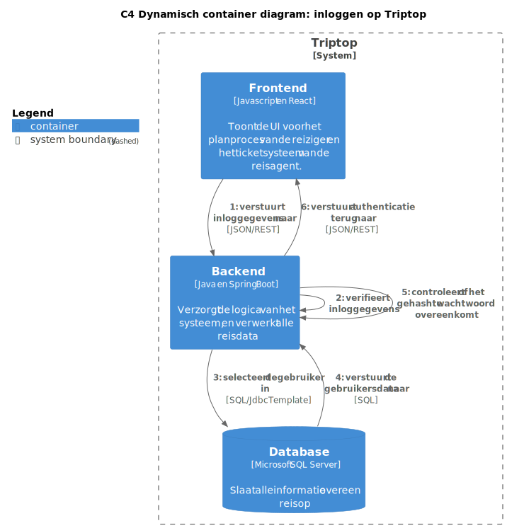

# Software Guidebook Triptop

## 1. Introductie

Dit software guidebook geeft een overzicht van de Triptop-applicatie. Het bevat een samenvatting van het volgende:

1. De vereisten, beperkingen en principes.
2. De software-architectuur, met inbegrip van de technologiekeuzes op hoog niveau en de structuur van de software.
3. De ontwerp- en codebeslissingen die zijn genomen om de software te realiseren.
4. De architectuur van de infrastructuur en hoe de software kan worden geïnstalleerd.

## 2. Context

In dit hoofdstuk wordt de context van de software beschreven. Dit omvat de gebruikers, het systeem en de externe systemen die met de software communiceren.


> **Figuur 1:** Context diagram van de Triptop-applicatie.
> 
> - Rechtsboven in het diagram staat de legenda met de betekenis van de kleuren in het diagram.
> - Het externe systeem **Mollie** is toegevoegd voor betalingen, maar de implementatie hiervan is nog onduidelijk. Dit wordt in de prototypes niet meegenomen, omdat dit geen hoofdzaak is en geen prioriteit heeft.
> 
> In [figuur 11](#711-container-diagram) is een container diagram te zien dat ingezoomd is op het systeem uit dit context diagram.

### 2.1. Toelichting Functionaliteit
In het systeem kunnen reizigers reizen plannen en boeken, en wordt alle informatie opgehaald aan de hand van API's.

### 2.2. Toelichting Gebruikers
Het systeem heeft twee typen gebruikers: de **reiziger** en de **beheerder**.
- De reiziger is de primaire gebruiker van de applicatie. De reiziger kan met zijn account reizen plannen en boeken.
- De reis agent heeft sinds de implementatie van deze applicatie een minder belangrijke rol. Hij kan gebeld worden door de reiziger om te helpen met het boeken van een reis, en kan tickets afhandelen van reizigers die problemen hebben met hun reis.

### 2.3. Toelichting Externe Systemen
Wij hebben gekozen voor de onderstaande API's, omdat deze de meeste bouwstenen bevatten die wij nodig hebben voor onze applicatie. Deze keuze staat vastgelegd in [ADR-001 Externe systemen](#81-adr-001-externe-systemen).

- [Booking.com](https://rapidapi.com/DataCrawler/api/booking-com15/playground/apiendpoint_6767dbac-969b-4230-8d26-f8b007bb8094)
  - hotels
  - vluchten
  - autoverhuur
  - taxi
  - attracties
- [Tripadvisor](https://rapidapi.com/DataCrawler/api/tripadvisor16/playground/apiendpoint_b0128f2a-67c5-4bbd-9369-721cc7170f9c)
  - Flights
  - Hotels
  - Restaurants
  - "Vacation Rentals"
  - Cruises
  - Auto verhuur

De volgende API gaat niet zo zeer over de bouwstenen, maar over de betaalopties die wij willen integreren.

- [Mollie](https://docs.mollie.com/reference/payments-api)
  - Paypal
  - iDEAL
  - creditcard

## 3. Functioneel Overzicht

Om de belangrijkste features toe te lichten zijn er user stories en twee domain stories gemaakt en een overzicht van het domein in de vorm van een domeinmodel. Op deze plek staat typisch een user story map maar die ontbreekt in dit voorbeeld.

### 3.1 User Stories

#### 3.1.1 User Story 1: Reis plannen

Als gebruiker wil ik een zelfstandig op basis van diverse variabelen (bouwstenen) een reis kunnen plannen op basis van mijn reisvoorkeuren (wel/niet duurzaam reizen, budget/prijsklasse, 's nachts reizen of overdag etc.) zodat ik op vakantie kan gaan zonder dat hiervoor een reisbureau benodigd is.

#### 3.1.2 User Story 2: Reis boeken

Als gebruiker wil ik een geplande reis als geheel of per variabele (bouwsteen) boeken en betalen zodat ik op vakantie kan gaan zonder dat hiervoor een reisbureau benodigd is.

#### 3.1.3 User Story 3: Reis cancelen

Als gebruiker wil ik een geboekte reis, of delen daarvan, kunnen annuleren zodat ik mijn geld terug kan krijgen zonder inmenging van een intermediair zoals een reisbureau.

#### 3.1.4 User Story 4: Reisstatus bewaren

Als gebruiker wil ik mijn reisstatus kunnen bewaren zonder dat ik een extra account hoef aan te maken zodat ik mijn reis kan volgen zonder dat ik daarvoor extra handelingen moet verrichten.

#### 3.1.5 User Story 5: Bouwstenen flexibel uitbreiden

Als gebruiker wil ik de bouwstenen van mijn reis flexibel kunnen uitbreiden met een zelf te managen stap (bijv. met providers die niet standaard worden aangeboden zoals een andere reisorganisatie, hotelketen etc.) zodat ik mijn reis helemaal kan aanpassen aan mijn wensen.

### 3.2 Domain Story Reis Boeken (AS IS)


> **Figuur 2:** Domain Story Reis Boeken AS IS

### 3.3 Domain Story Reis Boeken (TO BE)


> **Figuur 3:** Domain Story Reis Boeken TO BE

### 3.4 Domain Model


> **Figuur 4:** Domain Model

## 4. Quality Attributes

Voordat deze casusomschrijving tot stand kwam, heeft de opdrachtgever de volgende ISO 25010 kwaliteitsattributen benoemd als belangrijk:

- Compatibility -> Interoperability (Degree to which a system, product or component can exchange information with other products and mutually use the information that has been exchanged)
- Reliability -> Fault Tolerance (Degree to which a system or component operates as intended despite the presence of hardware or software faults)
- Maintainability -> Modularity (Degree to which a system or computer program is composed of discrete components such that a change to one component has minimal impact on other components)
- Maintainability -> Modifiability (Degree to which a product or system can be effectively and efficiently modified without introducing defects or degrading existing product quality)
- Security -> Integrity (Degree to which a system, product or component ensures that the state of its system and data are protected from unauthorized modification or deletion either by malicious action or computer error)
- Security -> Confidentiality (Degree to which a system, product or component ensures that data are accessible only to those authorized to have access)

Naar aanleiding van deze kwaliteitsattributen zijn de volgende ontwerpvragen opgesteld en uitgewerkt:

### 4.1. Modularity - Alternatieve bouwstenen aanbieden

De volgende ontwerpvraag is uitgewerkt door **Jochem**:

> Hoe bied je de gebruiker op basis van zelfgekozen bouwstenen alternatieve bouwstenen aan, bijvoorbeeld als een bepaalde overnachting niet beschikbaar is of om een keuze te geven tussen vervoer per auto, trein of bus

De ontwerpvraag wordt uitgewerkt door middel van het **Strategy Design Pattern**. De keuze hiervoor is uitgelegd bij [ADR-005](#85-adr-005-pattern-voor-alternatieve-bouwstenen).

#### 4.1.1. Componenten en verantwoordelijkheden

- **Generieke controller**: Verantwoordelijk voor het verwerken van requests van de frontend en het doorgeven aan de juiste service.
- **Generieke service**: Verantwoordelijk voor het verwerken van de resultaten van externe services en het omzetten naar domeinobjecten.
- **Generieke strategy**: Verantwoordelijk voor het ophalen van alternatieve bouwstenen uit externe services, het genereren van aanvullende opties op basis van gebruikersvoorkeuren en het omzetten van deze alternatieven naar domeinobjecten.
- **ExternalAPIHandler**: Verantwoordelijk voor het aanroepen van externe services, het afhandelen van fouten en retries.

#### 4.1.2. Interfaces

- **Generieke controller**:
  ```
  GET /journey
  Body: {
      origin: String
      destination: String
      departureDate: Date
      returnDate: Date
      price: double
      transport: Transport
  }
  ```
- **Generieke service**:

  ```java
  public interface JourneyService {
      List<Journey> getJourneys(String origin, String destination, Date departureDate, Date returnDate, double price, Transport transport);
  }
  ```

- **Generieke strategy**:

  ```java
  public interface JourneyStrategy {
      List<Journey> getJourneys(String origin, String destination, Date departureDate, Date returnDate, double price, Transport transport);
  }
  ```

- **ExternalAPIHandler**:
  ```java
  public interface ExternalAPIHandler {
      String call(Endpoint endpoint);
  }
  ```

#### 4.1.3. Component diagrammen

Hieronder is een component diagram uitgewerkt.


> **Figuur 5:** Component diagram van alternatieve bouwstenen aanbieden
>
> In deze diagrammen gelden: als er op een pijl binnen de container boundary geen technologie staat, betekent dit dat het een method call is.
> In deze diagrammen is de werking van een generieke strategy uitgebeeld. Met generiek wordt bedoeld dat deze strategy niet specifiek is voor een bepaalde bouwsteen, maar dat deze kan worden toegepast op verschillende bouwstenen.


> **Figuur 6:** Dynamisch component diagram van alternatieve bouwstenen aanbieden
>
> We gaan ervan uit dat een gebruiker zelf de strategy kiest zoals aangetoond in [ADR-005](#85-adr-005-pattern-voor-alternatieve-bouwstenen).

#### 4.1.4. Klassen en functies

Hieronder is een class diagram uitgewerkt die de klassen en functies weergeeft die van belang zijn voor de ontwerpvraag.


> **Figuur 7:** Class diagram van alternatieve bouwstenen aanbieden
> 
> In dit diagram is de werking te zien van het prototype. Ongeacht het feit dat in het prototype niet alles van het domein Journey wordt behandeld hebben we wel het hele domein aangetoond om te laten zien hoe het er uiteindelijk uit komt te zien.
> De strategieën die worden behandeld zijn een standaard- en alternatieve strategie. In de standaard strategie wordt alleen een taxi trip behandeld, terwijl in de alternatieve strategie zowel taxi als huurauto en vlucht wordt behandeld.
>
> Dit klassendiagram maakt gebruik van de volgende design principes:
> - Program to an Interface
> - Single Responsibility Principle
> - Open/Closed Principle

#### 4.1.5 Sequentie diagram

Hieronder is een sequentie diagram uitgewerkt die de werking van het kiezen van een strategy weergeeft.


> **Figuur 8:** Sequentie diagram van alternatieve bouwstenen aanbieden
> 
> In dit diagram is de werking te zien van het prototype.
> Aangezien in het prototype alleen gebruik wordt gemaakt van de origin van het Journey domein, hebben we de rest van het domein weggelaten om verwarring te voorkomen.
> Ook hebben we de loops in het diagram verkort met een kleine uitleg, aangezien in elke loop heel veel methodes worden aangeroepen die een Journey aanpassen (setters) wat het diagram ontzettend groot zou maken.

### 4.2. Modifiability - Verschillende boekingsservices integreren
De volgende ontwerpvraag is uitgewerkt door **Roald**:
> Hoe kunnen verschillende boekingsservices (zoals Booking.com en eigen beheer in Triptop) worden geïntegreerd?

De ontwerpvraag wordt uitgewerkt door middel van het **Adapter Design Pattern**.

#### 4.2.1. Componenten en verantwoordelijkheden

- **BookingController**: Verantwoordelijk voor het verwerken van requests van de frontend en het doorgeven aan de juiste service.
- **BookingService**: Verantwoordelijk voor het verwerken van de resultaten van boeking services en het omzetten naar domeinobjecten.
- **BookingAdapter**: Verantwoordelijk voor het aanroepen van boeking services, het afhandelen van fouten en retries, en het cachen van resultaten om fault tolerance te bieden.
- **BookingComAdapter**: Verantwoordelijk voor het aanroepen van de externe API's van Booking.com en het omzetten naar domeinobjecten.
- **BookingComApi**: Verantwoordelijk voor het aanroepen van de externe API's van Booking.com en het omzetten naar domeinobjecten.


#### 4.2.2. Interfaces
Hieronder zijn de interfaces van de componenten die van belang zijn voor de ontwerpvraag uitgewerkt. Deze interfaces geven een overzicht van de methodes die de componenten aanbieden.


#### 4.2.3. Component diagrammen
Hieronder is een component diagram uitgewerkt die de componenten en hun verantwoordelijkheden weergeeft. Dit diagram geeft een overzicht van de componenten en hun verantwoordelijkheden.

> **Figuur 9:** Component diagram van verschillende boekingsservices integreren
> 
> In dit diagram geldt: als er op een pijl binnen de container boundary geen technologie staat, betekent dit dat het een method call is.
> 
> TODO Roald: uitleg

#### 4.2.4. Klassen en functies
Hieronder is een class diagram uitgewerkt die de classes en functies weergeeft die van belang zijn voor de ontwerpvraag. Dit diagram geeft een overzicht van de classes en hun verantwoordelijkheden.


> **Figuur 10:** Class diagram van verschillende boekingsservices integreren
> 
> TODO Roald: uitleg

#### 4.2.5. Sequentie diagram
Hieronder is een sequentie diagram uitgewerkt die de volgorde van aanroepen weergeeft voor verschillende scenario's. Dit diagram geeft een overzicht van de volgorde van aanroepen en de interactie tussen de componenten.


> **Figuur 11:** Sequentie diagram van verschillende boekingsservices integreren
> 
> TODO Roald: uitleg

### 4.3. Fault Tolerance - Externe services die niet beschikbaar zijn

De volgende ontwerpvraag is uitgewerkt door **Stijn**:

> Hoe ga je om met aanroepen van externe services die niet beschikbaar zijn en toch verwacht wordt dat er waardevolle output gegeven wordt?

De ontwerpvraag wordt uitgewerkt door middel van het **Facade Design Pattern**.

#### 4.3.1. Componenten en verantwoordelijkheden

Als eerst is er een overzicht gemaakt van de componenten en hun verantwoordelijkheden die van belang zijn voor de ontwerpvraag.

- **FlightsController**: Verantwoordelijk voor het verwerken van requests van de frontend en het doorgeven aan de FlightsService.
- **FlightsServiceImpl**: Verantwoordelijk voor het verwerken van de resultaten van externe services en het omzetten naar domeinobjecten.
- **ExternalAPIHandlerImpl**: Verantwoordelijk voor het aanroepen van externe services, het afhandelen van fouten, en het cachen van resultaten om fault tolerance te bieden.
- **RedisCacheRepositoryImpl**: Verantwoordelijk voor het opslaan en ophalen van resultaten in de cache. Wordt gebruikt door de ExternalAPIHandler.
- Buiten container: **Redis**: Verantwoordelijk voor het cachen van resultaten van externe services.

#### 4.3.2. Interfaces

Hieronder zijn de interfaces van de componenten die van belang zijn voor de ontwerpvraag uitgewerkt. Deze interfaces geven een overzicht van de methodes die de componenten aanbieden.

- **FlightsController**:
  ```
  GET /flights/getFlightPrice
  Parameters: {
      origin: string,
      destination: string,
      departureDate: string,
      returnDate: string
  }
  ```
- **FlightsService**:
  ```java
  public interface FlightsService {
      String getAirportId(String query);
      double getFlightPrice(String origin, String destination, String departureDate, String returnDate);
  }
  ```
- **ExternalAPIHandler**:
  ```java
  public interface ExternalAPIHandler {
      Optional<Response> sendRequest(Request request, boolean dataMayGetOutdated);
  }
  ```
- **CacheRepository**:
  ```java
  public interface CacheRepository {
      void save(String url, Response response, Integer keepForSeconds);
      Optional<Response> get(String url);
  }
  ```
- **Request en Response**:
  ```java
  public record Request(String url, HashMap<String, String> headers) {}
  
  public record Response(int statusCode, JSONObject body, Origin origin) {}
  
  public enum Origin {
      EXTERNAL_API, REDIS_CACHE
  }
  ```

#### 4.3.3. Component diagrammen

Hieronder is een dynamisch container diagram uitgewerkt die de volgorde van aanroepen van externe services weergeeft.


> **Figuur 12:** Dynamisch component diagram van externe services
> 
> In dit diagram geldt: als er op een pijl binnen de container boundary geen technologie staat, betekent dit dat het een method call is.
> 
> Als de relaties niet goed te lezen zijn, is het originele .puml bestand [hier te vinden](./sgb-bestanden/ontwerpvragen/Fault%20Tolerance%20-%20volgorde%20van%20aanroepen.puml).
> 
> De beslissing om de nieuwste API-data voor de cache te laten gaan is vastgelegd in [ADR-004: Nieuwste API data gaat voor cache](#84-adr-004-nieuwste-api-data-gaat-voor-cache).

#### 4.3.4. Klassen en functies

Hieronder is een class diagram uitgewerkt die de klassen en functies weergeeft die van belang zijn voor de ontwerpvraag.


> **Figuur 13:** Class diagram van externe services
> 
> In dit klassendiagram maakt ExternalAPIHandlerImpl gebruik van het **Facade Design Pattern**, omdat het een eenvoudige interface biedt voor het ophalen van responses, zonder dat de gebruiker hoeft af te weten van de onderliggende cache-implementatie.
> 
> Het diagram maakt gebruik van de volgende design principes:
> - Program to an Interface
> - Dependency Inversion Principle
> - Single Responsibility Principle

#### 4.3.5. Sequentie diagram

Hieronder is een sequence diagram uitgewerkt die de volgorde van aanroepen weergeeft voor verschillende scenario's.


> **Figuur 14:** Sequence diagram van externe services
> 
> Dit sequence diagram toont twee belangrijke scenario's voor fault tolerance:
> 
> 1. **Scenario 1 (dataMayGetOutdated = false)**: Eerst wordt de cache gecontroleerd. Als er een cache hit is, wordt het gecachte resultaat teruggegeven. Als er een cache miss is, wordt de externe API aangeroepen. Als de API succesvol is, wordt het resultaat gecached en teruggegeven. Als de API faalt, wordt een NotFoundException gegooid.
> 
> 2. **Scenario 2 (dataMayGetOutdated = true)**: Eerst wordt de externe API aangeroepen. Als de API succesvol is, wordt het resultaat gecached en teruggegeven. Als de API faalt, wordt de cache gecontroleerd. Als er een cache hit is, wordt het gecachte resultaat teruggegeven. Als er een cache miss is, wordt een NotFoundException gegooid.
> 
> Deze aanpak zorgt ervoor dat de applicatie blijft functioneren, zelfs wanneer externe services niet beschikbaar zijn, door terug te vallen op gecachte resultaten wanneer nodig.

## 5. Constraints

Bij het ontwikkelen van de applicatie zijn de volgende beperkingen vastgesteld:

### Programmeertalen en frameworks:
- Frontend wordt ontwikkeld in **JavaScript** met **React**.
- Backend wordt ontwikkeld in **Java** met **Spring Boot**.

### Database:
- Main database ontwikkeld met **SQL Server**
  - Zie [ADR-003: keuze database](#83-adr-003-keuze-database) voor uitleg van deze keuze.
- Cache wordt ontwikkeld met **Redis**.

### Externe API's:
- Alleen **Booking.com** en **Tripadvisor** worden gebruikt als externe systemen voor het ophalen van data.
  - Zie [ADR-001: Externe systemen](#81-adr-001-externe-systemen) voor uitleg van deze keuze.

## 6. Design principes

Bij het ontwikkelen van de TripTop-applicatie hebben we een aantal belangrijke architecturele en design principes toegepast om de kwaliteit, onderhoudbaarheid en uitbreidbaarheid van de software te waarborgen. 
Deze principes hebben ons geholpen om een robuuste en flexibele architectuur te creëren die kan voldoen aan de veranderende eisen van onze gebruikers.
De gekozen principes zijn afgestamd uit de design patterns die wij hebben toegepast in onze ontwerpvragen.

De principes die we bewust hebben toegepast zijn onder andere:
- Program to an Interface
- Single Responsibility Principle
- Open/Closed Principle
- Dependency Inversion Principle

## 7. Software Architectuur

### 7.1. Containers

In dit hoofdstuk wordt het container diagram aangetoond die de applicatie vormt.
Daarnaast zijn er ook twee dynamische container diagrammen die het inloggen en boeken van een reis beschrijven.

#### 7.1.1. Container diagram

In het container diagram is te zien hoe de verschillende containers met elkaar communiceren. De containers zijn de verschillende onderdelen van de applicatie. In dit geval zijn dat de front-end, back-end, database, cache en de externe API's.


> **Figuur 15:** Container diagram van de Triptop-applicatie
> 
> Dit diagram geeft een overzicht van de verschillende containers binnen het systeem dat in [figuur 1](#2-context) is beschreven.
> 
> - De backend en database communiceren via Spring JDBC. Hierbij wordt gebruik gemaakt van Spring JDBC Template.
> - De backend en Redis cache communiceren via Jedis. Dit is een dependency in de pom.xml.
> - Mollie wordt aangeroepen via een REST API, maar het is nog onduidelijk wat voor response we krijgen (bijvoorbeeld JSON).

#### 7.1.2. Dynamische container diagrammen

In de dynamische container diagrammen is te zien hoe de containers met elkaar communiceren, en in welke volgorde dat gebeurt. Hieronder zijn twee scenario's uitgewerkt: inloggen en een reis boeken.

##### 7.1.2.1 Inloggen


> **Figuur 16:** Dynamisch container diagram van inloggen op TripTop
> 
> In dit diagram geldt: als er op een pijl binnen de systeemgrens geen technologie staat, betekent dit dat het een method call is.
> 
> Hier wordt in stappen uitgelegd hoe een gebruiker inlogt op de website. De containers zijn gebaseerd op [het container diagram in figuur 11](#711-container-diagram). 

##### 7.1.2.2 Reis boeken


> **Figuur 17:** Dynamisch container diagram van een reis boeken op TripTop
>
> Hier wordt in stappen uitgelegd hoe een gebruiker een reis boekt op de website. De containers zijn gebaseerd op [het container diagram in figuur 11](#711-container-diagram).
> 
> Aangezien we nog niet weten hoe Mollie geïmplementeerd wordt, houdt dit diagram op bij de betaling.

### 7.2. Componenten
Hieronder staat de component diagram van Triptop. Hierin zijn de design patterns verwerkt die we hebben gekozen voor onze ontwerpvragen.


> **Figuur 18:** Component diagram van de Triptop backend
> 
> Alle componenten in dit diagram zijn generiek. Dit houdt in dat het toegepast kan worden op alle bouwstenen en dus niet specifiek voor één bouwsteen geldt.
> Bij een service heb je de optie om een strategy te gebruiken of niet. Strategies worden voornamelijk gebruikt voor alternatieve opties bij een bouwsteen.

### 7.3. Design & Code

De klassendiagrammen en sequentie diagrammen zijn uitgewerkt in de verschillende ontwerpvragen. 
Hieronder wordt aangegeven waar die diagrammen te vinden zijn per ontwerpvraag:
- [Modularity - Alternatieve bouwstenen aanbieden](#41-modularity---alternatieve-bouwstenen-aanbieden)
  - [Component diagram](#413-component-diagrammen)
  - [Class diagram](#414-klassen-en-functies)
  - [Sequence diagram](#415-sequentie-diagram)
- [Modifiability - Verschillende boekingsservices integreren](#42-modifiability---verschillende-boekingsservices-integreren)
  - [Component diagram](#423-component-diagrammen)
  - [Class diagram](#424-klassen-en-functies)
  - [Sequence diagram](#425-sequentie-diagram)
- [Fault Tolerance - Externe services die niet beschikbaar zijn](#43-fault-tolerance---externe-services-die-niet-beschikbaar-zijn)
  - [Component diagram](#433-component-diagrammen)
  - [Class diagram](#434-klassen-en-functies)
  - [Sequence diagram](#435-sequentie-diagram)

## 8. Architectural Decision Records

In dit hoofdstuk worden een aantal architecturale beslissingen beschreven die zijn genomen tijdens het ontwerpen en bouwen van de prototypes.

### 8.1. ADR-001 Externe systemen

#### Context

Onze applicatie heeft data van externe systemen nodig zodat gebruikers een trip kunnen boeken. Om het aantal externe systemen kort te houden hebben we een tweetal externe systemen gekozen die zoveel mogelijk bouwstenen bevatten.

#### Alternatieven

We hadden een aardige lijst van api's gemaakt die we mogelijk konden gebruiken voor onze applicatie.
Er waren een paar systemen die er boven uit kwamen. Hieronder is een tabel die aantoont welke bouwstenen de externe systemen bevatten.

| **Extern systeem** | **Hotels** | **Vluchten** | **Attracties** | **Autoverhuur** | **Restaurants** | **Overig vervoer** |
| ------------------ | ---------- | ------------ | -------------- | --------------- | --------------- | ------------------ |
| **Booking**        | x          | x            | x              | x               |                 | x                  |
| **TravelData**     |            | x            |                |                 |                 |                    |
| **Flight Scraper** | x          | x            |                | x               |                 |                    |
| **Tripadvisor**    | x          | x            |                | x               | x               | x                  |

We hebben uiteindelijk de verschillende bouwstenen vergeleken van alle api's en hebben gekozen voor Tripadvisor en Booking.
Aangezien Tripadvisor en Booking zowel vluchten, hotels en autoverhuur bevatten raken ze alle bouwstenen die TravelData en Flight Scraper hebben.
Verder hebben de gekozen systemen ook nog meer bouwstenen die noodzakelijk zijn voor de applicatie zoals attracties en restaurants.

#### Besluit

We gaan Booking en Tripadvisor als onze externe systemen gebruiken.

#### Status

Geaccepteerd

#### Consequenties

- Als een van de externe systemen uit valt, zal gelijk een groot deel van de mogelijkheden op onze website niet meer zichtbaar zijn.
- Doordat we slechts twee externe systemen gebruiken, kunnen we informatie sneller ophalen en efficiënt verwerken. Dit vermindert de complexiteit van onze integratie en verhoogt de stabiliteit.
- Er zijn minder kosten aan het gebruiken van externe systemen.
- Minder API's betekend minder onderhoud.

### 8.2. ADR-002 Hoe we omgaan met het "tegelijk" versturen van meerdere API requests

#### Context

Binnen deze applicatie worden er een hoop API requests gedaan. Deze requests kunnen erg lang duren, afhankelijk van de API die wordt aangesproken. Het is daarom belangrijk om te bepalen hoe we omgaan met het moeten versturen van meerdere requests om data uit verschillende API's te halen.

#### Alternatieven

| Methode           | Beschrijving                         | Implementatie | Snelheid | Flexibiliteit |
| ----------------- | ------------------------------------ | ------------- | -------- | ------------- |
| Synchroon         | Requests achter elkaar versturen     | ++            | --       | +             |
| CompletableFuture | Snel en flexibel voor meerdere calls | -             | ++       | +             |
| ExecutorService   | Als je expliciet threadbeheer wilt   | --            | ++       | -             |
| Spring @Async     | Voor betere Spring-integratie        | --            | ++       | -             |

#### Besluit

Met oog op simpliciteit hebben wij er voor gekozen om voorlopig de requests achter elkaar te versturen. Dit betekent dat we eerst de ene request versturen en wachten op een response voordat we de volgende request versturen.

#### Status

Voorgesteld

#### Consequenties

- De applicatie is simpeler te implementeren
- De snelheid van de applicatie kan hierdoor afnemen

### 8.3. ADR-003 Keuze Database

#### Context

We moeten een keuze maken voor een database voor de applicatie.

#### Alternatieven

| Database      | Kennis | Open Source |
| ------------- | ------ | ----------- |
| MS SQL Server | +      | -           |
| PostgreSQL    | -      | +           |
| MySQL         |        | +           |

#### Besluit

We kiezen voor MS SQL Server als database omdat we al ervaring hebben met deze database.

#### Status

Geaccepteerd

#### Consequenties

- We moeten de database in docker draaien.
- Alle huidige developers kunnen meteen beginnen met implementeren

### 8.4. ADR-004 Nieuwste API data gaat voor cache

#### Context

Actuele reisgegevens zijn cruciaal vanwege snel veranderende prijzen en beschikbaarheid. Verouderde data kan leiden tot frustratie bij gebruikers. Tegelijkertijd kunnen frequente API-aanroepen de prestaties beïnvloeden en kosten verhogen. Een balans tussen actualiteit, prestaties en betrouwbaarheid is noodzakelijk.

#### Alternatieven

| Strategie                  | Beschrijving                                                                                          | Actualiteit van gegevens | Prestaties | Betrouwbaarheid |
| -------------------------- | ----------------------------------------------------------------------------------------------------- | ------------------------ | ---------- | --------------- |
| **API-first**              | Altijd eerst de API aanroepen, cache alleen gebruiken als fallback wanneer de API niet beschikbaar is | ++                       | -          | +               |
| **Stale-while-revalidate** | Eerst cache tonen (indien beschikbaar), dan API op de achtergrond aanroepen om cache te verversen     | -                        | ++         | -               |
| **Cache-first**            | Altijd cache gebruiken als die beschikbaar is, API alleen aanroepen als cache leeg of verlopen is     | -                        | ++         | --              |

#### Besluit

We kiezen voor de API-first strategie: altijd eerst de API aanroepen voor actuele data en alleen terugvallen op cache bij onbeschikbaarheid. Dit garandeert actuele informatie en voorkomt frustratie door verouderde gegevens. Andere strategieën bieden minder betrouwbaarheid of actualiteit.

#### Status

Geaccepteerd

#### Consequenties

**Positieve consequenties:**

- Gebruikers krijgen altijd de meest actuele informatie over prijzen, beschikbaarheid en andere reisgegevens.
- Verhoogde betrouwbaarheid van de getoonde informatie.

**Negatieve consequenties:**

- Meer API-verzoeken kunnen leiden tot hogere kosten.
- Mogelijk langere laadtijden voor gebruikers, vooral bij trage API-responses.

### 8.5. ADR-005 Pattern voor Alternatieve Bouwstenen

#### Context

Voor onze applicatie willen we de mogelijkheid hebben om alternatieve bouwstenen aan te tonen buiten de gekozen bouwsteen.
Denk bijvoorbeeld aan het zoeken voor een toepasselijke reis. Stel je probeert een treinrit te zoeken voor een bepaalde datum, maar er zijn geen treinritten meer beschikbaar, dan zal de app als alternatieve reisopties wat busritten of taxiritten aantonen.

#### Alternatieven

We hebben de volgende opties overwogen om alternatieve bouwstenen te beheren. Hieronder volgt een vergelijkingstabel op basis van verschillende criteria.
We zoeken een betere oplossing dan if-else statements voor het geven van alternatieven. Hiervoor kijken we vooral naar uitbreidbaarheid, koppeling, en cohesie.
Aangezien het de bedoeling is om alternatieve bouwstenen aan te geven in een bepaalde situatie vallen de gekozen patterns binnen behavioral design patterns. Dit betekent dat we als alternatieven Strategy en State pattern hebben.

| **Optie**               | **Uitbreidbaarheid** | **Lage koppeling** | **Hoge cohesie** |
|-------------------------|----------------------|--------------------|------------------|
| **Strategy Pattern**    | ++                   | ++                 | ++               |
| **State Pattern**       | ++                   | +                  | +                |

Aangezien beide patterns de mogelijkheid geven om makkelijk een nieuwe state/strategy toe te voegen zonder dat dit de code van andere states/strategies beïnvloed (Open/Closed Principle) zijn ze even uitbreidbaar.
Beide hebben lage koppeling, maar een strategy pattern is toch iets lager aangezien de strategieën meer gescheiden kunnen worden gehouden dan states. States kunnen namelijk nog afhankelijk van elkaars logica zijn.
In het geval van complexere logica zal een state pattern ook wat lagere cohesie hebben als een strategy pattern, aangezien er meer interacties tussen toestanden kunnen optreden.

In principe zijn beide patterns een goede oplossing, maar het ligt voornamelijk ook aan de situatie.
Als we gebruikers de keuze willen geven tussen bepaalde alternatieven is een strategy pattern beter.
Maar als we het aantonen van alternatieven automatisch willen afhandelen is het handiger om een state pattern te gebruiken.

#### Besluit

Aangezien op de ontwerpvraag de focus voornamelijk op strategy pattern is gezet kiezen we voor het **Strategy Pattern** aangezien deze pattern de mogelijkheid geeft om tijdens de runtime de strategy te veranderen. Dit sluit aan op de functionaliteit die wij willen realiseren voor de gebruiker.

#### Status

Geaccepteerd

#### Consequenties

- Nieuwe alternatieven kunnen eenvoudig worden toegevoegd zonder de bestaande code te breken.
- De logica wordt minder complex, waardoor het onderhoud van de applicatie gemakkelijker wordt.
- Elke bouwsteen kan afzonderlijk worden getest.
- In een code met weinig algoritmes maak je de code te ingewikkeld.
- Een gebruiker moet een idee hebben wat hun keuze doet, wanneer ze een strategie kiezen.

## 9. Deployment, Operation and Support

Deze sectie beschrijft de vereisten en stappen om de Triptop-applicatie te installeren en te runnen.

### 9.1. Vereisten

- **Java**: JDK 21 of hoger
- **IntelliJ IDEA**: Voor ontwikkeling (met Maven integratie)
- **Docker**: Voor het draaien van Redis cache

### 9.2. Installatie en configuratie

#### 9.2.1. Redis cache

De applicatie maakt gebruik van Redis als cache voor externe API-responses. Start Redis met de docker-compose.yml door in de root van het project de volgende command uit te voeren:

```bash
docker compose up -d
```

Dit start een Redis server op poort 6379 (geconfigureerd in het .env bestand).

#### 9.2.2. Spring Boot applicatie

De Spring Boot applicatie moet worden uitgevoerd vanuit de root folder van het project om ervoor te zorgen dat alle resources correct worden geladen. Volg hiervoor de onderstaande stappen:
1. Open het project in IntelliJ IDEA door het bestand `pom.xml` in de root folder te openen. IntelliJ herkent dan automatisch dat het om een Maven-project gaat.
2. Run de applicatie via de main class.

> **Let op:** Het openen van het project vanuit een subfolder kan leiden tot problemen, zoals het niet correct laden van resources. Zorg er daarom altijd voor dat het project vanuit de root folder wordt geopend.
