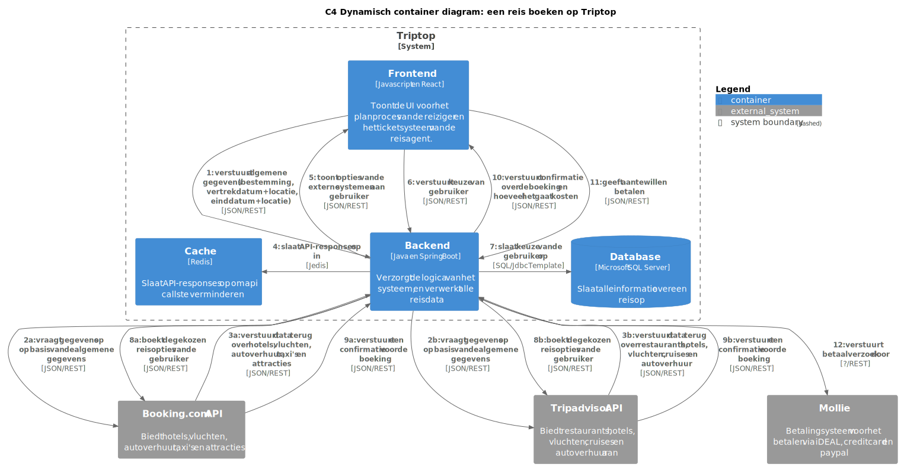

# Software Guidebook Triptop

## 1. Introduction
Dit software guidebook geeft een overzicht van de Triptop-applicatie. Het bevat een samenvatting van het volgende: 
1. De vereisten, beperkingen en principes. 
2. De software-architectuur, met inbegrip van de technologiekeuzes op hoog niveau en de structuur van de software. 
3. De ontwerp- en codebeslissingen die zijn genomen om de software te realiseren.
4. De architectuur van de infrastructuur en hoe de software kan worden geïnstalleerd. 

## 2. Context

[//]: # (> [!IMPORTANT])
[//]: # (> Werk zelf dit hoofdstuk uit met context diagrammen en een beschrijving van de context van de software.)

In dit hoofdstuk wordt de context van de software beschreven. Dit omvat de gebruikers, het systeem en de externe systemen die met de software communiceren.


### 2.1. Toelichting
We hebben gekozen voor de Booking en TripAdvisor API's aangezien die alle bouwstenen in één hebben. 
Ook hebben we gekozen voor Mollie als betalingssysteem, aangezien deze veel betalingsmogelijkheden support en alle opties bevat die een algemene Nederlander gebruikt.

[//]: # (Toelichting op de context van de software inclusief System Context Diagram:)

[//]: # (* Functionaliteit)

[//]: # (* Gebruikers)

[//]: # (* Externe systemen)

## 3. Functional Overview

Om de belangrijkste features toe te lichten zijn er user stories en twee domain stories gemaakt en een overzicht van het domein in de vorm van een domeinmodel. Op deze plek staat typisch een user story map maar die ontbreekt in dit voorbeeld.

### 3.1 User Stories

#### 3.1.1 User Story 1: Reis plannen

Als gebruiker wil ik een zelfstandig op basis van diverse variabelen (bouwstenen) een reis kunnen plannen op basis van mijn reisvoorkeuren (wel/niet duurzaam reizen, budget/prijsklasse, 's nachts reizen of overdag etc.) zodat ik op vakantie kan gaan zonder dat hiervoor een reisbureau benodigd is.

#### 3.1.2 User Story 2: Reis boeken

Als gebruiker wil ik een geplande reis als geheel of per variabele (bouwsteen) boeken en betalen zodat ik op vakantie kan gaan zonder dat hiervoor een reisbureau benodigd is.

#### 3.1.3 User Story 3: Reis cancelen

Als gebruiker wil ik een geboekte reis, of delen daarvan, kunnen annuleren zodat ik mijn geld terug kan krijgen zonder inmenging van een intermediair zoals een reisbureau.

#### 3.1.4 User Story 4: Reisstatus bewaren 

Als gebruiker wil ik mijn reisstatus kunnen bewaren zonder dat ik een extra account hoef aan te maken zodat ik mijn reis kan volgen zonder dat ik daarvoor extra handelingen moet verrichten.

#### 3.1.5 User Story 5: Bouwstenen flexibel uitbreiden

Als gebruiker wil ik de bouwstenen van mijn reis flexibel kunnen uitbreiden met een zelf te managen stap (bijv. met providers die niet standaard worden aangeboden zoals een andere reisorganisatie, hotelketen etc.) zodat ik mijn reis helemaal kan aanpassen aan mijn wensen.

### 3.2 Domain Story Reis Boeken (AS IS)


### 3.3 Domain Story Reis Boeken (TO BE)


### 3.4 Domain Model


## 4. Quality Attributes

Voordat deze casusomschrijving tot stand kwam, heeft de opdrachtgever de volgende ISO 25010 kwaliteitsattributen benoemd als belangrijk:
* Compatibility -> Interoperability (Degree to which a system, product or component can exchange information with other products and mutually use the information that has been exchanged)
* Reliability -> Fault Tolerance (Degree to which a system or component operates as intended despite the presence of hardware or software faults)
* Maintainability -> Modularity (Degree to which a system or computer program is composed of discrete components such that a change to one component has minimal impact on other components)
* Maintainability -> Modifiability (Degree to which a product or system can be effectively and efficiently modified without introducing defects or degrading existing product quality)
* Security -> Integrity (Degree to which a system, product or component ensures that the state of its system and data are protected from unauthorized modification or deletion either by malicious action or computer error)
* Security -> Confidentiality (Degree to which a system, product or component ensures that data are accessible only to those authorized to have access)

Naar aanleiding van deze kwaliteitsattributen zijn de volgende ontwerpvragen opgesteld en uitgewerkt:

### 4.1. Modularity - Alternatieve bouwstenen aanbieden
De volgende ontwerpvraag is uitgewerkt door **Jochem**:
> Hoe bied je de gebruiker op basis van zelfgekozen bouwstenen alternatieve bouwstenen aan, bijvoorbeeld als een bepaalde overnachting niet beschikbaar is of om een keuze te geven tussen vervoer per auto, trein of bus

- (dynamisch) Component diagram
- Class diagram
- evt. link naar ADR's
- En natuurlijk toelichting

### 4.2. Modifiability - Verschillende boekingsservices integreren
De volgende ontwerpvraag is uitgewerkt door **Roald**:
> Hoe kunnen verschillende boekingsservices (zoals Booking.com en eigen beheer in Triptop) worden geïntegreerd?

- (dynamisch) Component diagram
- Class diagram
- evt. link naar ADR's
- En natuurlijk toelichting

### 4.3. Fault Tolerance - Externe services die niet beschikbaar zijn
De volgende ontwerpvraag is uitgewerkt door **Stijn**:
> Hoe ga je om met aanroepen van externe services die niet beschikbaar zijn en toch verwacht wordt dat er waardevolle output gegeven wordt?

#### 4.3.1. Componenten en verantwoordelijkheden
Als eerst is er een overzicht gemaakt van de componenten en hun verantwoordelijkheden die van belang zijn voor de ontwerpvraag.

- **Generieke controller**: Verantwoordelijk voor het verwerken van requests van de frontend en het doorgeven aan de juiste service.
- **Generieke service**: Verantwoordelijk voor het verwerken van de resultaten van externe services en het omzetten naar domeinobjecten.
- **ExternalAPIHandler**: Verantwoordelijk voor het aanroepen van externe services, het afhandelen van fouten en retries, en het cachen van resultaten om fault tolerance te bieden.
- **CacheRepository**: Verantwoordelijk voor het opslaan en ophalen van resultaten in de cache. Wordt gebruikt door de ExternalAPIHandler.
- Buiten container: **Cache**: Verantwoordelijk voor het cachen van resultaten van externe services.

#### 4.3.2. Interfaces
Hieronder zijn de interfaces van de componenten die van belang zijn voor de ontwerpvraag uitgewerkt. Deze interfaces geven een overzicht van de methodes die de componenten aanbieden.

- **Generieke controller**:
    ```
    GET /flights
    Body: {
        origin: string,
        destination: string,
        departureDate: Date,
        returnDate: Date
    }
    ```
- **Generieke service**:
    ```java
    public interface FlightsService {
        public List<Flight> getFlights(String origin, String destination, Date departureDate, Date returnDate);
    }
    ```
- **CacheRepository**:
    ```java
    public interface CacheRepository {
        public void save(Endpoint key, String response, Duration duration);
        public String get(Endpoint key);
    }

    public record Endpoint(Method method, String url, HashMap<String, String> queryParams, String bodyHash) {
        public Endpoint(Method method, String url, HashMap<String, String> queryParams) {
            this(method, url, queryParams, "");
        }

        public Endpoint(Method method, String url, String body) {
            this(method, url, new HashMap<>(), body);
        }

        public Endpoint(Method method, String url) {
            this(method, url, new HashMap<>(), "");
        }
    }

    public enum Method {
        GET, POST, PUT, DELETE
    }
    ```
- **ExternalAPIHandler**:
    ```java
    public interface ExternalAPIHandler {
        public String call(Endpoint endpoint);
    }
    ```

#### 4.3.3. Volgorde van aanroepen
Hieronder is een dynamisch container diagram uitgewerkt die de volgorde van aanroepen van externe services weergeeft. De relaties naar de Externe API zijn slecht te lezen doordat ze overlappen. Deze connecties zijn beter te lezen in [het bestand zelf](./sgb-bestanden/ontwerpvragen/Fault%20Tolerance%20-%20volgorde%20van%20aanroepen.puml).

<!-- link to `8.4. ADR-004 Nieuwste API data gaat voor cache` -->
Bij dit diagram hoort [ADR-004: Nieuwste API data gaat voor cache](#84-adr-004-nieuwste-api-data-gaat-voor-cache).


#### 4.3.4. Klassen en functies
Hieronder is een class diagram uitgewerkt die de klassen en functies weergeeft die van belang zijn voor de ontwerpvraag.


- evt. link naar ADR's

## 5. Constraints

> [!IMPORTANT]
> Beschrijf zelf de beperkingen die op voorhand bekend zijn die invloed hebben op keuzes die wel of niet gemaakt kunnen of mogen worden.

## 6. Principles

> [!IMPORTANT]
> Beschrijf zelf de belangrijkste architecturele en design principes die zijn toegepast in de software.

## 7. Software Architecture

###     7.1. Containers

[//]: # (> [!IMPORTANT])

[//]: # (> Voeg toe: Container Diagram plus een Dynamic Diagram van een aantal scenario's inclusief begeleidende tekst.)
#### 7.1.1. Container diagram

In het container diagram is te zien hoe de verschillende containers met elkaar communiceren. De containers zijn de verschillende onderdelen van de applicatie. In dit geval zijn dat de front-end, back-end, database, cache en de externe API's.


#### 7.1.2. Dynamische container diagrammen

In de dynamische container diagrammen is te zien hoe de containers met elkaar communiceren, en in welke volgorde dat gebeurt. Hieronder zijn twee scenario's uitgewerkt: inloggen en een reis boeken.

##### 7.1.2.1 Inloggen


##### 7.1.2.2 Reis boeken


Aangezien we nog niet weten hoe Mollie in elkaar zit houdt het diagram hier op.

###     7.2. Components

> [!IMPORTANT]
> Voeg toe: Component Diagram plus een Dynamic Diagram van een aantal scenario's inclusief begeleidende tekst.

###     7.3. Design & Code

> [!IMPORTANT]
> Voeg toe: Per ontwerpvraag een Class Diagram plus een Sequence Diagram van een aantal scenario's inclusief begeleidende tekst.

## 8. Architectural Decision Records

<!-- > [!IMPORTANT]
> Voeg toe: 3 tot 5 ADR's die beslissingen beschrijven die zijn genomen tijdens het ontwerpen en bouwen van de software. -->

### 8.1. ADR-001 Externe systemen

#### Context

Onze applicatie heeft data van externe systemen nodig zodat gebruikers een trip kunnen boeken. Om het aantal externe systemen kort te houden hebben we een tweetal externe systemen gekozen die zoveel mogelijk bouwstenen bevatten.

#### Considered Options

We hadden een aardige lijst van api's gemaakt die we mogelijk konden gebruiken voor onze applicatie.
Er waren een paar systemen die er boven uit kwamen. Hieronder is een tabel die aantoont welke bouwstenen de externe systemen bevatten.

| **Extern systeem** | **Hotels** | **Vluchten** | **Attracties** | **Autoverhuur** | **Restaurants** | **Overig vervoer** |
|--------------------|------------|--------------|----------------|-----------------|-----------------|--------------------|
| **Booking**        | x          | x            | x              | x               |                 | x                  |
| **TravelData**     |            | x            |                |                 |                 |                    |
| **Flight Scraper** | x          | x            |                | x               |                 |                    |
| **Tripadvisor**    | x          | x            |                | x               | x               | x                  |


We hebben uiteindelijk de verschillende bouwstenen vergeleken van alle api's en hebben gekozen voor Tripadvisor en Booking.
Aangezien Tripadvisor en Booking zowel vluchten, hotels en autoverhuur bevatten raken ze alle bouwstenen die TravelData en Flight Scraper hebben.
Verder hebben de gekozen systemen ook nog meer bouwstenen die noodzakelijk zijn voor de applicatie zoals attracties en restaurants.

#### Decision

We gaan Booking en Tripadvisor als onze externe systemen gebruiken.

#### Status

Geaccepteerd

#### Consequences

- Als een van de externe systemen uit valt zal gelijk een groot deel van de mogelijkheden op onze website niet meer zichtbaar zijn.
- Doordat we slechts twee externe systemen gebruiken, kunnen we informatie sneller ophalen en efficiënt verwerken. Dit vermindert de complexiteit van onze integratie en verhoogt de stabiliteit.
- Er zijn minder kosten aan het gebruiken van externe systemen.
- Minder API's betekend minder onderhoud.

### 8.2. ADR-002 Hoe we omgaan met het "tegelijk" versturen van meerdere API requests

#### Context

Binnen deze applicatie worden er een hoop API requests gedaan. Deze requests kunnen erg lang duren, afhankelijk van de API die wordt aangesproken. Het is daarom belangrijk om te bepalen hoe we omgaan met het moeten versturen van meerdere requests om data uit verschillende API's te halen.

#### Alternatieven

| Methode           | Beschrijving                         | Implementatie | Snelheid | Flexibiliteit |
|-------------------|--------------------------------------|---------------|----------|---------------|
| Synchroon         | Requests achter elkaar versturen     | ++            | --       | +             |
| CompletableFuture | Snel en flexibel voor meerdere calls | -             | ++       | +             |
| ExecutorService   | Als je expliciet threadbeheer wilt   | --            | ++       | -             |
| Spring @Async     | Voor betere Spring-integratie        | --            | ++       | -             |

#### Besluit

Met oog op simpliciteit hebben wij er voor gekozen om voorlopig de requests achter elkaar te versturen. Dit betekent dat we eerst de ene request versturen en wachten op een response voordat we de volgende request versturen.

#### Status

Voorgesteld

#### Consequenties

- De applicatie is simpeler te implementeren
- De snelheid van de applicatie kan hierdoor afnemen

### 8.3. ADR-003 Keuze Database

#### Context

We moeten een keuze maken voor een database voor de applicatie.

#### Alternatieven

| Database      | Kennis | Open Source |
|---------------|--------|-------------|
| MS SQL Server | +      | -           |
| PostgreSQL    | -      | +           |
| MySQL         |        | +           |

#### Besluit

We kiezen voor MS SQL Server als database omdat we al ervaring hebben met deze database.

#### Status

Geaccepteerd

#### Consequenties

- We moeten de database in docker draaien.
- Alle huidige developers kunnen meteen beginnen met implementeren

### 8.4. ADR-004 Nieuwste API data gaat voor cache

#### Context

Actuele reisgegevens zijn cruciaal vanwege snel veranderende prijzen en beschikbaarheid. Verouderde data kan leiden tot frustratie bij gebruikers. Tegelijkertijd kunnen frequente API-aanroepen de prestaties beïnvloeden en kosten verhogen. Een balans tussen actualiteit, prestaties en betrouwbaarheid is noodzakelijk.

#### Alternatieven

| Strategie | Beschrijving | Actualiteit van gegevens | Prestaties | Betrouwbaarheid |
|-----------|--------------|-------------|------------|-----------------|
| **API-first** | Altijd eerst de API aanroepen, cache alleen gebruiken als fallback wanneer de API niet beschikbaar is | ++ | - | + |
| **Stale-while-revalidate** | Eerst cache tonen (indien beschikbaar), dan API op de achtergrond aanroepen om cache te verversen | - | ++ | - |
| **Cache-first** | Altijd cache gebruiken als die beschikbaar is, API alleen aanroepen als cache leeg of verlopen is | - | ++ | -- |

#### Besluit

We kiezen voor de API-first strategie: altijd eerst de API aanroepen voor actuele data en alleen terugvallen op cache bij onbeschikbaarheid. Dit garandeert actuele informatie en voorkomt frustratie door verouderde gegevens. Andere strategieën bieden minder betrouwbaarheid of actualiteit.

#### Status

Geaccepteerd

#### Consequenties

**Positieve consequenties:**
- Gebruikers krijgen altijd de meest actuele informatie over prijzen, beschikbaarheid en andere reisgegevens.
- Verhoogde betrouwbaarheid van de getoonde informatie.

**Negatieve consequenties:**
- Meer API-verzoeken kunnen leiden tot hogere kosten.
- Mogelijk langere laadtijden voor gebruikers, vooral bij trage API-responses.

<!-- ### 8.5. ADR-005 TITLE

> [!TIP]
> These documents have names that are short noun phrases. For example, "ADR 1: Deployment on Ruby on Rails 3.0.10" or "ADR 9: LDAP for Multitenant Integration". The whole ADR should be one or two pages long. We will write each ADR as if it is a conversation with a future developer. This requires good writing style, with full sentences organized into paragraphs. Bullets are acceptable only for visual style, not as an excuse for writing sentence fragments. (Bullets kill people, even PowerPoint bullets.)

#### Context

> [!TIP]
> This section describes the forces at play, including technological, political, social, and project local. These forces are probably in tension, and should be called out as such. The language in this section is value-neutral. It is simply describing facts about the problem we're facing and points out factors to take into account or to weigh when making the final decision.

#### Considered Options

> [!TIP]
> This section describes the options that were considered, and gives some indication as to why the chosen option was selected.

#### Decision

> [!TIP]
> This section describes our response to the forces/problem. It is stated in full sentences, with active voice. "We will …"

#### Status

> [!TIP]
> A decision may be "proposed" if the project stakeholders haven't agreed with it yet, or "accepted" once it is agreed. If a later ADR changes or reverses a decision, it may be marked as "deprecated" or "superseded" with a reference to its replacement.

#### Consequences

> [!TIP]
> This section describes the resulting context, after applying the decision. All consequences should be listed here, not just the "positive" ones. A particular decision may have positive, negative, and neutral consequences, but all of them affect the team and project in the future. -->

## 9. Deployment, Operation and Support

> [!TIP]
> Zelf beschrijven van wat je moet doen om de software te installeren en te kunnen runnen.